# 🏢 Society Issues Resolver & Residency Tracker System

A full-stack web-based Society Issues Resolver & Residency Tracker System developed using PHP, MySQL, HTML, CSS, JavaScript and Tailwind CSS. This project helps residential societies manage member records, report issues, track complaints, schedule reminders and maintain society-related information through a centralized dashboard.

🌐 Live Demo:
https://societyissuesresolver.42web.io

---

## 🚀 Features

### 👤 User Authentication
- Secure Login & Registration System
- Session Management
- User Dashboard Access

### 🏠 Member Management
- View Society Members
- Flat Number Tracking
- Contact Information Directory
- Search & Filter Members

### 📝 Issue Reporting
- Report Society Issues
- Track Complaint Status
- Manage Community Problems
- Issue Voting Support

### ⏰ Reminder Management
- Create Personal Reminders
- Maintenance Notifications
- Event Reminders
- Important Society Updates

### 📅 Society Timetable
- Society Event Scheduling
- Community Activity Tracking
- Meeting & Maintenance Planning

### 📊 Dashboard
- Issue Statistics
- Reminder Overview
- Upcoming Events Summary
- Quick Navigation Cards

---

## 🛠️ Technologies Used

### Frontend
- HTML5
- CSS3
- JavaScript
- Tailwind CSS

### Backend
- PHP

### Database
- MySQL

### Hosting & Tools
- InfinityFree Hosting
- phpMyAdmin
- GitHub
- XAMPP

---

## 📂 Modules

- User Authentication
- Society Member Directory
- Issue Reporting System
- Reminder Management
- Society Timetable
- Dashboard Analytics
- Voting System

---

## 🎯 Project Objectives

- Simplify society management processes
- Provide a centralized issue reporting platform
- Improve communication among residents
- Maintain organized member records
- Track reminders and community events efficiently

---

## 📸 Project Screenshots

### 🔐 Login Page
User authentication system with secure login functionality.

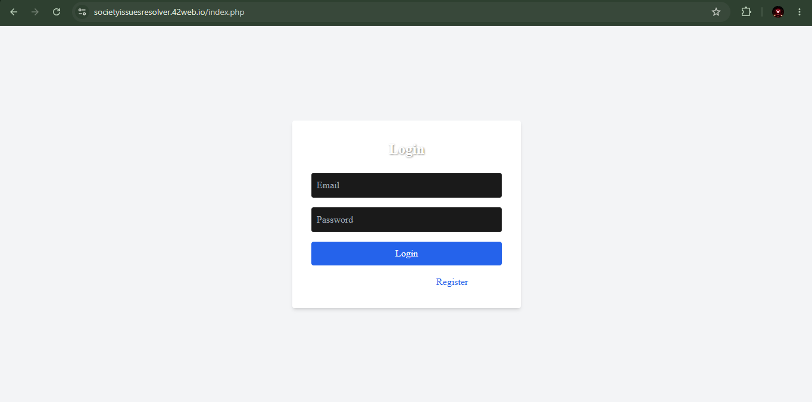

---

### 🏠 Dashboard
Central dashboard showing issue statistics, reminders, events and quick access modules.

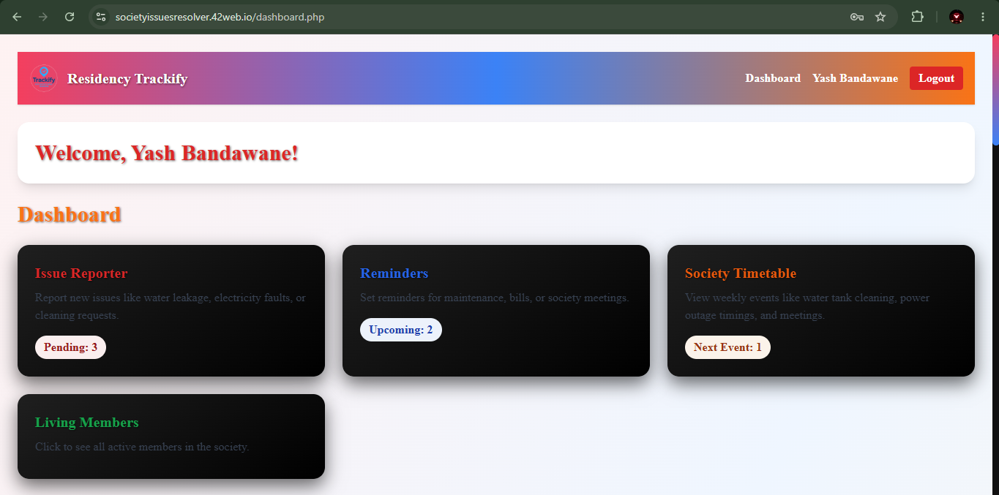

---

### 👥 Living Members Directory
View and manage society member records with search and filtering functionality.

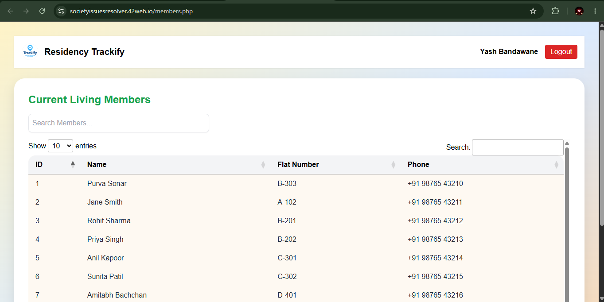

---

### 📝 Issue Reporting System
Residents can report society issues and complaints for management review.

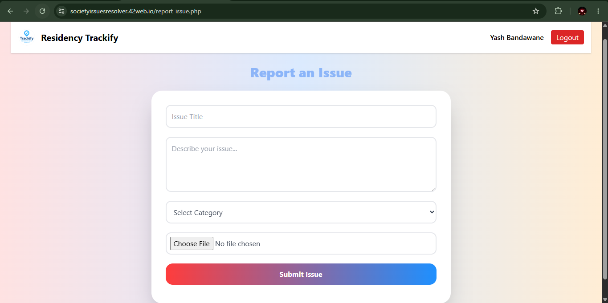

---

### 🚨 Issues Management
Track reported issues and monitor their status.

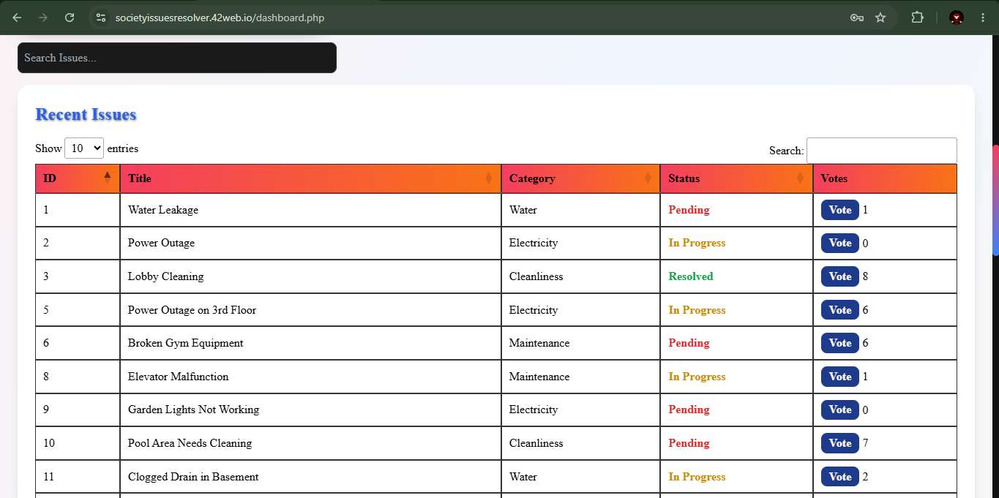

---

### 📊 Issue Priority Tracking
Manage and prioritize society complaints efficiently.

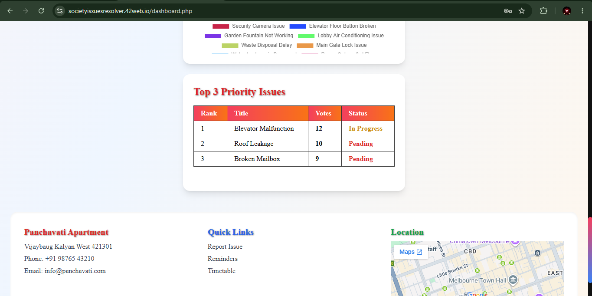

---

### 🗳️ Resident Voting System
Community voting feature for society-related decisions.

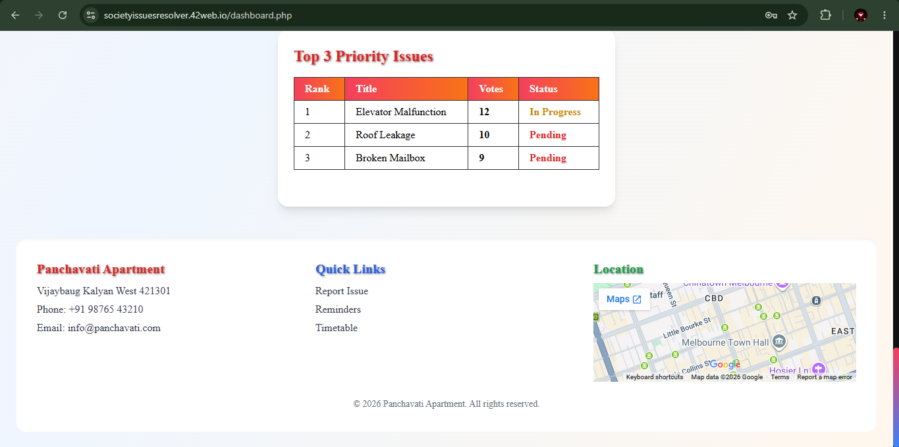

---

### ⏰ Reminder Management
Create and manage reminders for maintenance, meetings and important events.

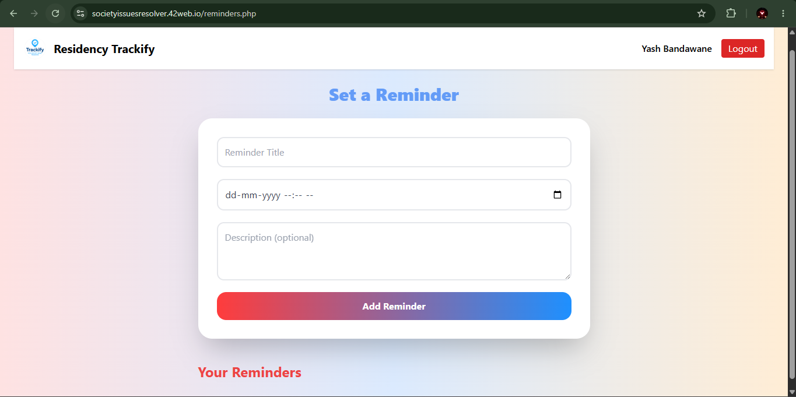

---

### 📅 Society Timetable
Schedule and track society activities and events.

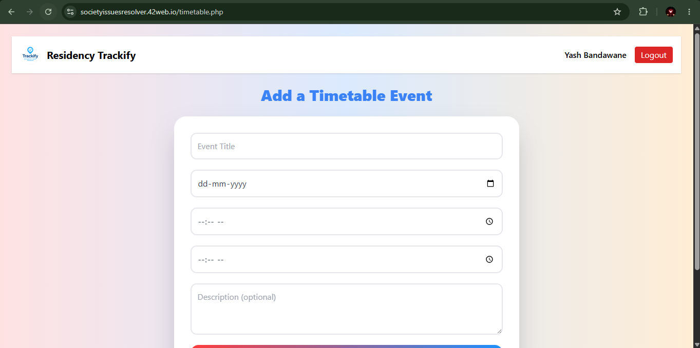

---

### 📈 Analytics Dashboard
Visual representation of society issue statistics and reports.

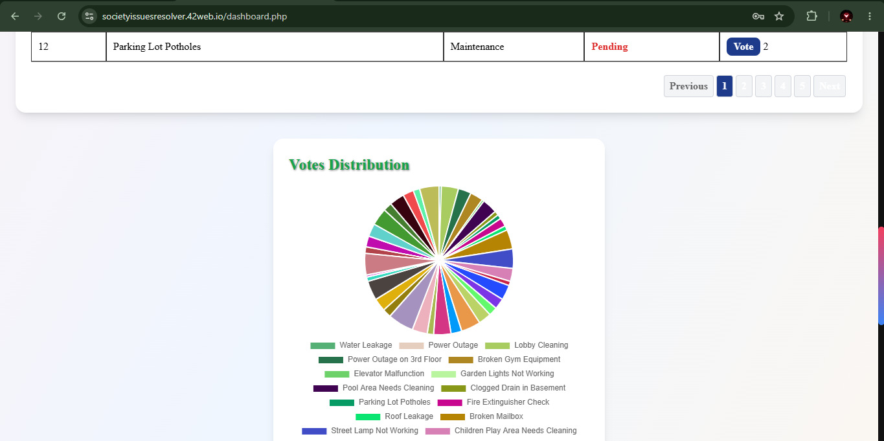

---

### 👤 Members Management
Detailed member information and records management.

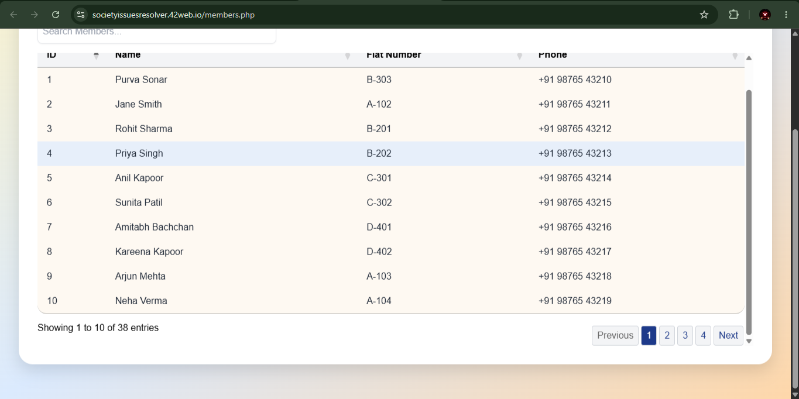

---

## 👨‍💻 Developer

**Yashwardhan Jain**

Diploma in Computer Engineering

GitHub:
https://github.com/yashbandawane04

---

## 📜 License

This project was developed for learning, portfolio and demonstration purposes.
